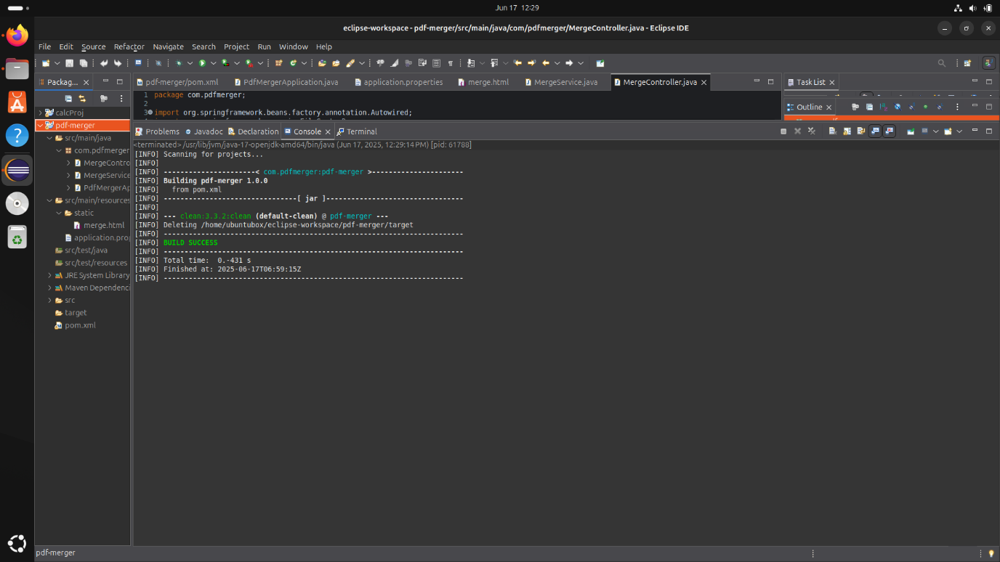
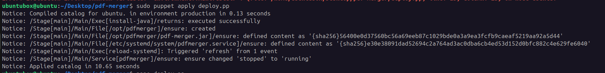

# Demo Link: https://devops-project-pdf-merger.onrender.com/merge.html

# DevOps Final Project

## Topic: PDF Merger Website

### Submitted by: Evan Ferrao

### Register Number: 23BAI1262

### Email: <evan.ferrao2023@vitstudent.ac.in>

### GitHub Link: https://github.com/evanferrao/devops-project-pdf-merger

### Tools Used: Java, Maven, Git, Puppet, Docker, Ansible, Graphite, Grafana, Jenkins.

## Step 1: Building the Java Application

Creating a new Eclipse Project

Giving the Project the name 'pdf-merger'

## Step 2: Defining the Java Project in Eclipse

Project Structure in Eclipse

Details of pom.xml

Details of application.properties

Details of merge.html (used for UI)

Details of MergeController.java

Details of PDFMergerApplication.java

Details of MergerService.java

## Step 3: Building the Java Application using Maven

Running mvn clean

Running mvn build

Running the jar file created in previous step

## Step 4: Demo of the website

Screnshot of website running on localhost port 1234

Selecting files for upload

Files loaded in the program website

Merge Button Pressed => Output file generated

Output file downloaded to computer

## Step 5: Setting up deployment with the help of puppet

Initial file for deploy.pp for use with puppet

Applying the puppet file

Checking the status of the puppet deployment

Creating Readme for puppet

## Step 6: Git for version control of out PDF Merger Website Application

Add files and commit the changes

Disable existing pdfmerger service

## Step 7: Docker Setup for deployment through Dockerfile

Initial Dockerfile for the deployment

Building the docker container

Running the docker container

Output of docker container running. Thus we have successfully run the pdf merger application using docker container

## Step 8: Ansible Playbook setup for advanced configuration of docker container and automation CI

Making ansible folder

Ansible playbook deploy.yml

Running ansible-playbook

Deployment of website using ansible playbook tasks. Thus we have deployed the website using ansible playbook.

## Step 9: Jenkins setup for CI

Initial Jenkins config file

Configuring Jenkins for building on new commit to repository

Linking the local repository on the \@git user of the virtual machine

Successfully setup Jenkins CI

Jenkins CI build output run

Successful deployment using Jenkins which is triggered on push to @master branch of the local git repository

Deployment of website automated using Jenkins CI on every push

## Step 10: Setting up graphite and Grafana for monitoring the usage and showing the statistics of websites.

We will be monitoring stats like

1.  PDF's merged

2.  PDF's failed to merge

3.  PDF merge queue

4.  CPU resources

5.  RAM utilization

PDF Merge Failures

PDF Merge Count

PDF Merge Count (when idle)

PDF Merge queue size (API Call Queue)

